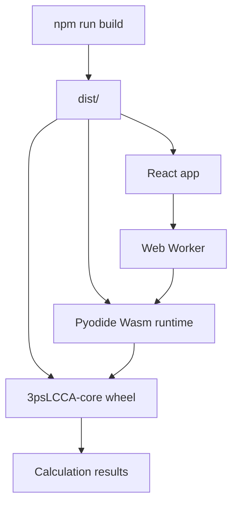

# 3psLCCA Web - Static WebAssembly Runtime

Run the existing Python core in the browser with Pyodide/CPython WebAssembly.

## Abstract

`3psLCCA-web` is a React/Vite interface for Life Cycle Cost Analysis of bridge
projects. The static WebAssembly runtime packages the existing
`3psLCCA-core` Python calculation engine into the browser, so production builds
do not need FastAPI or any Python server.

`npm run build` creates a static `dist/` folder containing the React app, the
Web Worker, the self-hosted Pyodide runtime, the `3psLCCA-core` wheel, and
reference data used by the WebAssembly smoke test. That folder can be served by
any static host.

FastAPI remains available only as an explicit development fallback.

## Features

- **Static client-side calculation.** The production app runs calculations in
  the browser from static files.
- **Self-hosted Pyodide runtime.** No external Python CDN is required at
  runtime.
- **Packaged `3psLCCA-core` wheel.** The build creates and ships the Python core
  as a pure-Python wheel.
- **Web Worker execution.** The Python runtime runs away from the main browser
  UI thread.
- **Native CPython parity smoke test.** Browser WebAssembly results are compared
  against native CPython reference outputs.
- **Report provenance.** Generated reports record the calculation source, core
  version, Pyodide version, and calculation timestamp.

## Getting Started

Clone the WebAssembly-enabled web branch and the matching core branch:

```bash
git clone -b feat/wasm-static-web https://github.com/Swayam200/3psLCCA-web.git
git clone -b feat/wasm-static-runtime https://github.com/Swayam200/3psLCCA-core.git

cd 3psLCCA-web
npm ci
```

### Run the development app

```bash
LCCA_CORE_PATH=../3psLCCA-core npm run dev
```

Open the local Vite URL printed by the terminal, usually:

```text
http://localhost:5173/
```

### Build the static site

```bash
LCCA_CORE_PATH=../3psLCCA-core npm run build
```

The build output is written to:

```text
dist/
```

### Serve the static output

```bash
python3 -m http.server 4173 --directory dist
```

Open:

```text
http://127.0.0.1:4173/
```

At this point the app is running from static files only.

## Verify WebAssembly is Working

Run the static build and browser parity test:

```bash
LCCA_CORE_PATH=../3psLCCA-core npm run build
npm run test:wasm
```

The test opens the static smoke page and checks that the browser result matches
native CPython reference calculations.

You can also verify it manually after serving `dist/`:

```text
http://127.0.0.1:4173/wasm-smoke.html
```

Expected visible proof:

```json
{
  "nativeParity": true,
  "indiaParity": true,
  "repeatStable": true,
  "source": "wasm"
}
```

### Manual app proof

1. Open the app.
2. Go to `Outputs`.
3. Confirm the engine indicator says:

   ```text
   Calculation engine: Browser WebAssembly
   ```

4. Click `Proceed with Calculation`.
5. Confirm the results page appears.
6. Click `Download Report`.
7. Generate the PDF report.
8. Confirm the report appendix includes:

   ```text
   Calculation engine: wasm
   Core version: ...
   Pyodide version: ...
   ```

## Runtime Flow



## Technical Notes

### Environment variables

| Variable | Purpose |
| --- | --- |
| `LCCA_CORE_PATH` | Path to the local `3psLCCA-core` repository used to build the wheel. |
| `LCCA_PYTHON` | Optional Python executable override for wheel/reference generation. |
| `VITE_BASE_PATH` | Base path for static subdirectory hosting, such as `/3pslcca/`. |
| `VITE_LCCA_ENGINE=backend` | Development-only switch for the FastAPI backend adapter. |

### Production default

Production uses the WebAssembly engine by default:

```text
VITE_LCCA_ENGINE=wasm
```

The backend adapter is not used unless explicitly selected during development:

```bash
VITE_LCCA_ENGINE=backend VITE_LCCA_API_URL=http://localhost:8000 npm run dev
```

### Static hosting

The `dist/` folder is static-host ready. It can be served by GitHub Pages,
Vercel, Netlify, Cloudflare Pages, or any ordinary static file server. Hosting
and CDN packaging details are intentionally kept separate from this getting
started guide.

For subdirectory hosting, build with:

```bash
VITE_BASE_PATH=/3pslcca/ LCCA_CORE_PATH=../3psLCCA-core npm run build
```

## Available Scripts

| Command | Description |
| --- | --- |
| `npm run dev` | Start the Vite development server. |
| `npm run build` | Prepare Wasm assets and build the static site into `dist/`. |
| `npm run preview` | Preview the production build locally with Vite. |
| `npm test` | Run JavaScript unit tests. |
| `npm run test:wasm` | Run the static browser WebAssembly parity test. |
| `npm run lint:wasm` | Lint the WebAssembly integration files. |

## Troubleshooting

### `Unable to build 3psLCCA-core`

Set `LCCA_CORE_PATH` to the matching local core repository:

```bash
LCCA_CORE_PATH=/absolute/path/to/3psLCCA-core npm run build
```

Also confirm Python build tools are installed:

```bash
python3 -m pip install build setuptools-scm
```

### Playwright browser is missing

Install Chromium once:

```bash
npx playwright install chromium
```

Then rerun:

```bash
npm run test:wasm
```

### App tries to use FastAPI

Unset the backend engine override and rebuild:

```bash
unset VITE_LCCA_ENGINE
LCCA_CORE_PATH=../3psLCCA-core npm run build
```

The production default is Browser WebAssembly.
